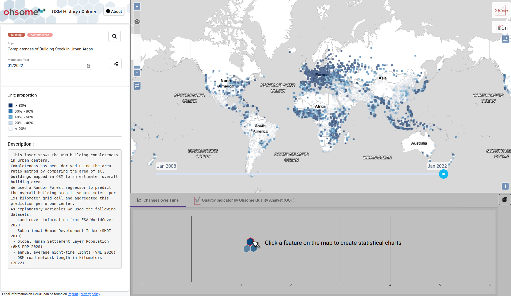

# Investigating completeness and inequalities in OpenStreetMap: spatio-temporal analysis of global urban building data

OpenStreetMap (OSM) has evolved as a popular geospatial dataset for global studies, such as monitoring progress towards the Sustainable Development Goals (SDGs).
However, many global applications turn a blind eye on its uneven spatial coverage. We utilized a regression model to infer OSM building completeness within 13,189 urban agglomerations home to 50\% of the global population.

Here we provide the python code and data for reproducing the analysis and figures presented in the global urban OSM building completeness analysis manuscript. Several jupyter notebooks and additional scripts are provided to pre-process the data.


## Data
Make sure to download geopackage data from HeiBox: https://heibox.uni-heidelberg.de/f/b2f22e7f341f48a89100/

You can also interactively explore the results in [ohsomeHex](https://hex.ohsome.org/#/urban_building_completeness/2022-01-01T00:00:00Z/2/29.21752531472042/16.251362043911197).
[](https://hex.ohsome.org/#/urban_building_completeness/2022-01-01T00:00:00Z/2/29.21752531472042/16.251362043911197)


## Create Figures, Maps and Tables
### Figures and Analyses
The processing steps for the analyses can be found in the `notebooks` section. The figures are stored in the `figures` directory.

### Maps
The maps are created in [QGIS](https://www.qgis.org/en/site/). All relevant data files, qgis project files and styles are stored in the geopackage `data/global_urban_building_completeness.gpkg`.


## Data Preparation
Insert the base data into the postgres tables for urban centers and grids. Insert data for corporate and humanitarian map edits.

initial tables on urban centers grid level:
* metadata_urban_centers_grid
* worldcover_2020_urban_centers_grid
* ghspop_2020_urban_centers_grid
* shdi_2019_urban_centers_grid
* vnl_2020_urban_centers_grid
* osm_roads_2022_urban_centers_grid
* osm_building_area_2023_urban_centers_grid
* external_reference_data_urban_centers_grid
* microsoft_reference_data_urban_centers_grid

initial tables on urban centers grid level:
* metadata_urban_centers

```
psql -p 5429 -U osm-paper -h localhost -d osm-paper -f data/all_parameters_urban_centers_grid.sql
psql -p 5429 -U osm-paper -h localhost -d osm-paper -f data/all_parameters_urban_centers.sql
psql -p 5429 -U osm-paper -h localhost -d osm-paper -f data/reference_data_urban_centers_grid_raw.sql
psql -p 5429 -U osm-paper -h localhost -d osm-paper -f scripts/update_table_structure.sql
```

Optional: Update OSM building stats grid cell. (This might take some time depending on how many urban centers will be analysed.)
```
python scripts/update_osm_buildings_stats_grid_2023.py
```

Optional: Update OSM road stats grid cell. (This might take some time depending on how many urban centers will be analysed.)
```
python scripts/update_osm_road_stats_grid_2023.py
```

Optional: Update GHS-POP data per grid cell
* download the latest version from GHS-POP Website at 1 kilometer resolution for 2020: https://ghsl.jrc.ec.europa.eu/download.php?ds=pop
* https://jeodpp.jrc.ec.europa.eu/ftp/jrc-opendata/GHSL/GHS_POP_GLOBE_R2022A/GHS_POP_E2020_GLOBE_R2022A_54009_1000/V1-0/GHS_POP_E2020_GLOBE_R2022A_54009_1000_V1_0.zip
* clip ghspop raster to urban centers extent `gdal_calc.py -A ghssmod_binary.tif -B GHS_POP_E2015_GLOBE_R2019A_54009_1K_V1_0.tif --outfile=ghspop_urban_centers_2020.tif --calc="B*(A>0)" --NoDataValue=0`
* convert raster to vector in QGIS with `Polygonize` tool
* import to postgis DB
* update tables `full_urban_centers_grid` and `full_urban_centers` with 2020 ghspop values

Optional: Update reference building data or Microsoft building data stats per grid cell.
```
# TODO: add script to update microsoft data
psql -p 5429 -U osm-paper -h localhost -d osm-paper -f scripts/create_reference_data_urban_centers_grid.sql
```

Optional: Update humanitarian OSM contributions made through HOT Tasking Manager.

* get the latest data from [HumStats website/database](https://humstats.heigit.org/index.html) (table: `osm_user_contributions_per_project_per_day`)
  * `pg_dump --data-only -h localhost -p 5001 -d mm_stats -U mm_stats --no-owner -t data_preparation.osm_user_contributions_per_project_per_day > data/osm_user_contributions_per_project_per_day.sql`
  * `pg_dump --data-only -h localhost -p 5001 -d mm_stats -U mm_stats --no-owner -t data_preparation.projects > data/hot_tm_projects.sql`
  * `pg_dump --data-only -h localhost -p 5001 -d mm_stats -U mm_stats --no-owner -t data_preparation.sessions > data/hot_tm_sessions.sql`
  * `psql -p 5429 -U osm-paper -h localhost -d osm-paper -f scripts/create_table_osm_user_contributions_per_project_per_day.sql`
  * `psql -p 5429 -U osm-paper -h localhost -d osm-paper -f data/osm_user_contributions_per_project_per_day.sql`
  * `psql -p 5429 -U osm-paper -h localhost -d osm-paper -f data/hot_tm_projects.sql`
  * `psql -p 5429 -U osm-paper -h localhost -d osm-paper -f data/hot_tm_sessions.sql`
* calculate the daily OSM user contributions for buildings for all urban_centers using oshdb2pg tool (table: `osm_user_contributions_per_urban_center_per_day`)
  * `psql -p 5429 -U osm-paper -h localhost -d osm-paper -f scripts/create_table_osm_user_contributions_per_urban_center_per_day.sql`
  * `psql -p 5429 -U osm-paper -h localhost -d osm-paper -f data/osm_user_contributions_per_urban_center_per_day.sql`
  * `pg_dump --data-only -h localhost -p 5001 -d mm_stats -U mm_stats --no-owner -t public.osm_user_contributions_per_urban_center_per_day_since_2021 > data/osm_user_contributions_per_urban_center_per_day_since_2021.sql` 
  * `psql -p 5429 -U osm-paper -h localhost -d osm-paper -f data/osm_user_contributions_per_urban_center_per_day_since_2021.sql`
* flag which user contributions per urban center are made through HOT Tasking Manager
  * `psql -p 5429 -U osm-paper -h localhost -d osm-paper -f scripts/hot_stats.sql`

### Prediction and Intra-Urban Inequality Measures
Run ML model to predict building area per 1km x 1km grid cell. Then calculate completeness per grid cell and aggregate prediction results for each urban center and derive completeness for each year.

```
python scripts/run_prediction.py reference
psql -p 5429 -U osm-paper -h localhost -d osm-paper -f scripts/aggregate_completeness_reference.sql
```

First run the prediction above only considering the reference data in training. Then run the model which can also correct for too high prediction, by considering the existing OSM data for cities which are completely mapped.

```
python scripts/run_prediction.py reference_and_osm
psql -p 5429 -U osm-paper -h localhost -d osm-paper -f scripts/aggregate_completeness_reference_and_osm.sql
```

Calculate intra-urban inequality measures (Gini coefficient and Moran's I) for urban centers with a minimum size of 25 square kilometers. Then run agglomerative clustering.
```
python scripts/intra_urban_inequality_measures.py
python scripts/agglomerative_clustering.py
```

Compare Microsoft Buildings and Geo-Wiki grid cells.

```
psql -p 5429 -U osm-paper -h localhost -d osm-paper -f scripts/microsoft_buildings_performance.sql
```

### Performance
Run ML model several times using spatial cross validation approach

```
python scripts/model_performance.py
psql -p 5429 -U osm-paper -h localhost -d osm-paper -f scripts/model_performance_residuals.sql
```

### Export data
Export data into GeoPackage file for easier handling in QGIS and jupyter notebooks.

```
ogr2ogr -f "GPKG" data/global_urban_building_completeness.gpkg PG:"host=localhost port=5429 dbname=osm-paper user=osm-paper password=osm-paper" -update -overwrite -nlt POLYGON -nln all_parameters_urban_centers -sql "SELECT * FROM full_urban_centers"
ogr2ogr -f "GPKG" data/global_urban_building_completeness.gpkg PG:"host=localhost port=5429 dbname=osm-paper user=osm-paper password=osm-paper" -update -overwrite -nlt POLYGON -nln all_parameters_urban_centers_grid -sql "SELECT * FROM full_urban_centers_grid"
ogr2ogr -f "GPKG" data/global_urban_building_completeness.gpkg PG:"host=localhost port=5429 dbname=osm-paper user=osm-paper password=osm-paper" -update -overwrite -nlt POLYGON -nln rf_adjusted_prediction_reference_and_osm -sql "SELECT * FROM prediction_reference_and_osm_urban_centers_grid"
ogr2ogr -f "GPKG" data/global_urban_building_completeness.gpkg PG:"host=localhost port=5429 dbname=osm-paper user=osm-paper password=osm-paper" -update -overwrite -nlt POLYGON -nln rf_adjusted_prediction_reference_and_osm_urban_centers -sql "SELECT * FROM prediction_reference_and_osm_urban_centers"
ogr2ogr -f "GPKG" data/global_urban_building_completeness.gpkg PG:"host=localhost port=5429 dbname=osm-paper user=osm-paper password=osm-paper" -update -overwrite -nlt POLYGON -nln performance_20_clusters_reference_and_osm -sql "SELECT * FROM performance_20_clusters_reference_and_osm"
ogr2ogr -f "GPKG" data/global_urban_building_completeness.gpkg PG:"host=localhost port=5429 dbname=osm-paper user=osm-paper password=osm-paper" -update -overwrite -nlt POLYGON -nln inequality_measures_urban_centers -sql "SELECT a.*, b.geom FROM inequality_measures_with_clusters_urban_centers a LEFT JOIN full_urban_centers b ON a.urban_center_id = b.urban_center_id"
ogr2ogr -f "GPKG" data/global_urban_building_completeness.gpkg PG:"host=localhost port=5429 dbname=osm-paper user=osm-paper password=osm-paper" -update -overwrite -nlt POINT -nln geowiki_grids_final -sql "SELECT * FROM geowiki_grids_final"
ogr2ogr -f "GPKG" data/global_urban_building_completeness.gpkg PG:"host=localhost port=5429 dbname=osm-paper user=osm-paper password=osm-paper" -update -overwrite -nln osm_user_contributions_per_urban_center_per_day_with_flag -sql "SELECT * FROM osm_user_contributions_per_urban_center_per_day_with_flag"
```

Export data as sql files for ohsomeHex visualisation.
```
psql -p 5429 -U osm-paper -h localhost -d osm-paper -f scripts/export_for_ohsome_hex.sql
pg_dump --data-only -h localhost -p 5429 -d osm-paper -U osm-paper -t urban_building_completeness_grid > data/urban_building_completeness_grid.sql
pg_dump --data-only -h localhost -p 5429 -d osm-paper -U osm-paper -t urban_building_completeness_polygon > data/urban_building_completeness_polygon.sql
pg_dump --data-only -h localhost -p 5429 -d osm-paper -U osm-paper -t urban_building_completeness_point > data/urban_building_completeness_point.sql
```
